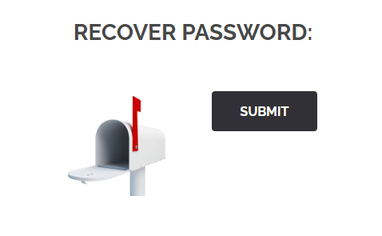

[README.md](../../../README.md)
# Password recover
## Reconnaissance
When going to the recover password page: `http://172.16.0.98/index.php?page=recover`
We can see a strange form with a button, missing a input field for email or username.



When inspecting the page, we can found an hidden field.
```html
<form action="#" method="POST">
	<input type="hidden" name="mail" value="webmaster@borntosec.com" maxlength="15">
	<input type="submit" name="Submit" value="Submit">
</form>
```

When we attempt to tweak the value in the hidden field, if we set an empty value:
```html
<form action="#" method="POST">
	<input type="hidden" name="mail" value="" maxlength="15">
	<input type="submit" name="Submit" value="Submit">
</form>
```

The website respond with this message:
`THE FLAG IS : 1D4855F7337C0C14B6F44946872C4EB33853F40B2D54393FBE94F49F1E19BBB0`

## Exploit
This field can be used to mail bomb email addresses.

## Prevention
A simple form validation, to check if the input match any database user record.

Sending an email link would be a better solution.